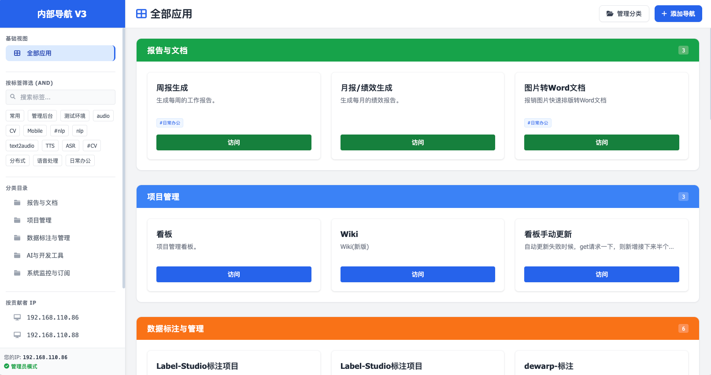

# WuKongNav (悟空导航)



**WuKongNav** 是一款为团队量身定制的高颜值、功能强大的内网导航与资源管理工具。它旨在解决团队内部工具多、文档散、环境杂的痛点，提供一站式的链接索引、文件托管以及快速页面发布功能。

---

## 🌟 核心特性

- 🎨 **极简美学设计**：基于现代 Web 设计语言，提供丝滑的交互体验和极致的视觉冲击。
- 🏷️ **灵活分类与标签**：支持自定义分类（颜色编码）和多标签系统，让海量工具井然有序。
- 📤 **多种发布方式**：
    - **快捷链接**：一键添加外部或内网工具链接。
    - **HTML 上传**：直接上传 HTML 静态页面进行在线预览。
    - **代码粘贴**：支持直接粘贴 HTML 代码，快速生成临时的展示或测试页面。
- 🛡️ **IP 访问控制**：内置安全机制，仅允许授权 IP 进行编辑、删除等敏感操作，保障数据安全。
- 🔍 **状态监控**：实时（或准实时）监测链接状态，确保每一个入口都畅通无阻。
- 📱 **响应式布局**：完美适配 PC、平板与手机，随时随地查阅工具。

---

## 🛠️ 技术栈

- **后端**: [Go](https://golang.org/) + [Gin Web Framework](https://gin-gonic.com/)
- **数据**: 轻量级 JSON 存储 (`static/nav_data.json`)
- **前端**: 原生 HTML5, Modern CSS (Vanilla CSS), Vanilla JavaScript
- **部署**: 单二进制文件运行，无需复杂环境配置

---

## 🚀 快速开始

### 1. 环境准备
确保已安装 [Go](https://golang.org/doc/install) (推荐 1.18+)。

### 2. 下载与运行
```bash
# 克隆仓库
git clone <repository-url>
cd WuKongNav

# 启动服务
go run main.go
```

服务启动后，默认在 `http://localhost:8000` 运行。

### 3. 系统配置
在 `main.go` 中，你可以修改 `allowedIPs` 变量来配置拥有编辑权限的客户端 IP：

```go
var allowedIPs = map[string]bool{
    "127.0.0.1":       true,
    "192.168.1.100":   true, // 替换为你的 IP
}
```

---

## 📂 目录结构

```text
.
├── main.go             # 后端核心逻辑
├── static/             # 静态资源 (CSS, JS, JSON 数据)
│   └── nav_data.json   # 导航数据持久化文件
├── templates/          # HTML 模板文件
├── images/             # 项目截图与资源
├── uploads/            # 遗留上传目录
└── user_pages/         # 用户上传/粘贴的 HTML 页面存储
```

---

## 📸 界面预览


---

## 🤝 参与贡献

欢迎通过提交 Issue 或 Pull Request 来完善 **WuKongNav**。

1. Fork 本仓库
2. 创建特性分支 (`git checkout -b feature/AmazingFeature`)
3. 提交更改 (`git commit -m 'Add some AmazingFeature'`)
4. 推送到分支 (`git push origin feature/AmazingFeature`)
5. 开启 Pull Request

---

## 📄 开源协议

本项目采用 [MIT License](LICENSE) 开源协议。
